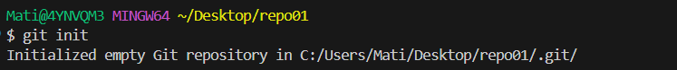
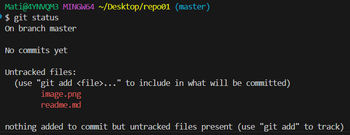
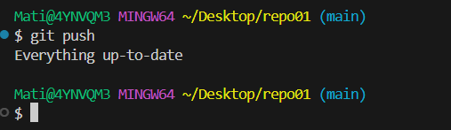
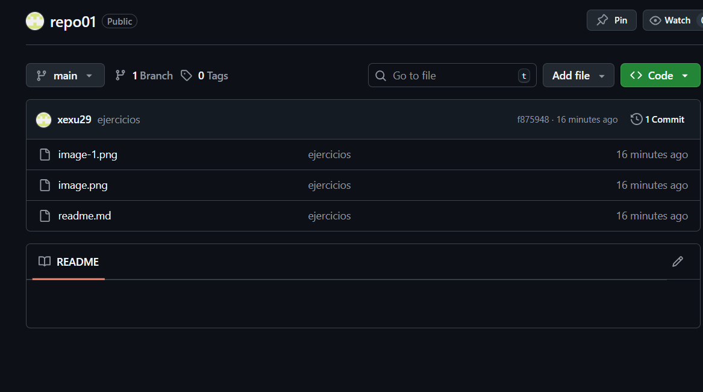
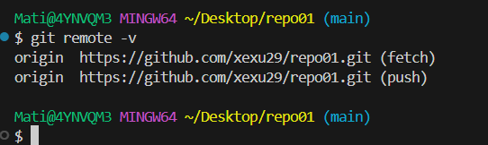
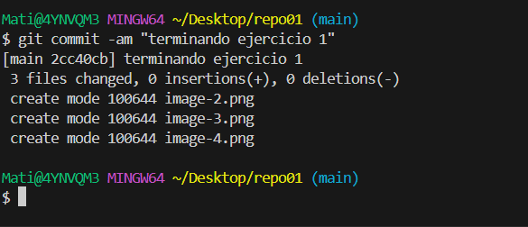
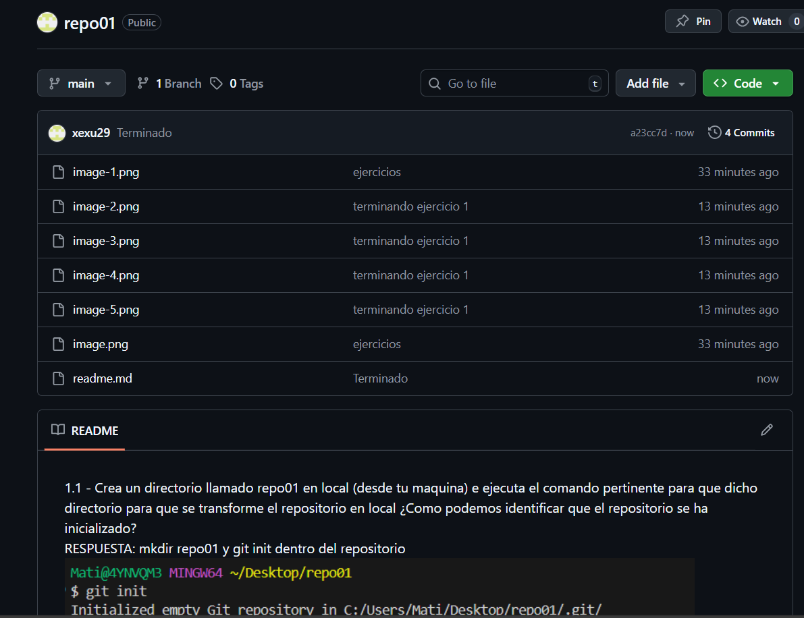

1.1 - Crea un directorio llamado repo01 en local (desde tu maquina) e ejecuta el comando pertinente para que dicho directorio para que se transforme el repositorio en local  ¿Como podemos identificar que el repositorio se ha inicializado?  
RESPUESTA: mkdir repo01 y git init dentro del repositorio 
  

1.3 Añade el fichero que acabamos de añadir al repositorio al staging area, visualiza el estado del repositorio (con git status) y haz un snapshot  (commit) del fichero hacia el nuestro repositorio local. ¿En que file status lifecycle se encuentra el fichero?  
Respuesta: El comando para saber en que estado esta el fichero seria git status
  

1.4 Intenta subir los ficheros al repositorio remoto mediante el comando git push ¿se te ocurre que esta pasando?  
Respuesta:En mi caso si que funciona porque ya he enlazado el repositorio local al remoto, pero no deberia de funcionar.
  
  

1.5 Ejecuta el comando git remote -v e investiga porque no nos aparece nada.  
Respuesta:No deberia de aparecer nada porque no se ha enlazado el repositorio local al remoto.
  
1.6 Crea un repositorio remoto llamado repo01, asocialo a tu repositorio local

  
1.7 Vuelve a ejecutar el comando git remote -v y explica el porque ahora si que aparece

1.8 Sube los cambios que hemos subido al snapshot local (commit) hacia al repositorio remoto.
  

1.9 Ves al repositorio remoto (en este caso GitHub) y comprueba que se haya realizado el commit correctamente y observa que pasa en el repositorio ¿Observas algo peculiar?
Respuesta:El readme.md Aparece en primera pagina
